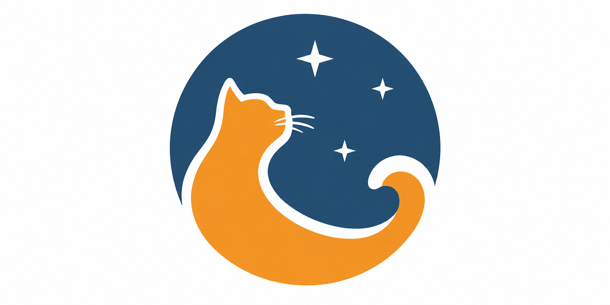

<p align="center">
  
</p>

# Skycat

Skycat is a **standalone Python package and command-line tool** for turning
mirrored astronomical reference catalogs into versioned, queryable local
PostgreSQL/PostGIS databases.

Its purpose is to give calibration, photometry, and observation-processing
pipelines a reproducible catalog layer: import known catalog releases, validate
them, activate the release that should serve by default, and query them locally
without depending on a live external catalog service.

Skycat is intentionally bounded. It owns the catalog database schema,
migrations, ingestion workflow, query API, and CLI. It does not try to be a
hosted catalog service, a data mirror, or a replacement for PostgreSQL/PostGIS.

Skycat currently ships support for APASS DR6, APASS DR10, VSX, Landolt
(1992 + 2009), and Stetson globular-cluster standards, plus an extension
pattern for future families such as Pan-STARRS, 2MASS, UCAC5, Tycho-2,
SkyMapper, and USNO-B1.0.

| Family | Releases | Source (CDS) | Parser format | Rows | Provider |
|--------|----------|--------------|---------------|------|----------|
| `apass` | DR6, DR10 | AAVSO | `apass_dr6_sum` / `apass_dr10_txt` | 42.6M / 128.6M | APASS |
| `vsx` | current | B/vsx | `vsx_dat` | 10.3M | VSX |
| `landolt` | 1992, 2009 | II/183A, J/AJ/137/4186 | `landolt_1992_dat` / `landolt_2009_dat` | 526 / 595 | Landolt |
| `stetson` | StetsonGlobs | J/MNRAS/485/3042 | `stetson_globs_dat` | 4.89M | StetsonGlobs |

It has its own SQLAlchemy declarative base, metadata, engine/session factory,
Alembic environment, schemas, database roles, and configuration namespace
(`SKYCAT_DB_*`). It is intended to be used as an independent catalog-ingestion
and query package, not as an add-on to a larger service.

## Installation

Skycat's supported public package artifacts are currently attached to GitHub
Releases. Install the wheel directly from the release assets:

```bash
python -m pip install \
  https://github.com/SkynetRTN/skycat/releases/download/v0.1.0/skycat-0.1.0-py3-none-any.whl
```

For a source install from a tag:

```bash
python -m pip install "git+https://github.com/SkynetRTN/skycat.git@v0.1.0"
```

Replace `v0.1.0` with the release tag you intend to run. The installed package
provides the `skycat` CLI, Python APIs, parsers, validators, and Alembic
migrations. See [docs/operations/release.md](docs/operations/release.md) for the release process and
artifact checks.

PyPI and TestPyPI publishing are being prepared as package-index channels. Until
the `skycat` project exists on PyPI, use the GitHub Release wheel or source-tag
install paths above.

## Package scope

Installing Skycat installs the control/query software only. It does **not**
install PostgreSQL, PostGIS, catalog source files, imported catalog rows,
production roles, storage, backups, credentials, or a hosted query endpoint.

To run a working catalog service, provision PostgreSQL/PostGIS, initialize and
migrate the catalog database, provide source data under `SKYCAT_DATA_ROOT`,
import releases, validate them, and activate the release each family should
serve by default.

## License

Skycat is licensed under the GNU General Public License v3.0. See
[LICENSE](LICENSE).

## Documentation

This README is the package guide. The rest is in [`docs/`](docs/README.md),
grouped by the question you arrived with:

| Document | Read it when |
|---|---|
| [docs/reference/architecture.md](docs/reference/architecture.md) | You want the whole design in one pass: schemas, release model, spatial model, ingestion, deployment. |
| [docs/reference/api-stability.md](docs/reference/api-stability.md) | You are building against Skycat and need to know what will not move under you. |
| [docs/guides/add-family.md](docs/guides/add-family.md) | You are adding a catalog family — the worked version of the checklist below. |
| [docs/guides/provenance.md](docs/guides/provenance.md) | You are mirroring source data, or need to prove a release matches an upstream snapshot. |
| [docs/operations/runbook.md](docs/operations/runbook.md) | You are about to run something destructive, watching a long import, or rotating credentials. |
| [docs/operations/performance.md](docs/operations/performance.md) | A query got slow, or you want targets to measure against. |
| [docs/operations/ci.md](docs/operations/ci.md) | A required check failed, or you are changing a workflow. |
| [docs/operations/release.md](docs/operations/release.md) | You are cutting a package release. |
| [docs/decisions/](docs/decisions/README.md) | You are about to propose something the project already decided against. |

`docs/working/` holds dated planning notes. They are snapshots of open work, not
descriptions of the current API, and are deliberately excluded from the
documentation tests.

---

## Why a local catalog database?

Reference catalogs are large (tens to hundreds of millions of rows), immutable
once published, versioned by release, and queried spatially. Keeping them in
their own database (`catalogs`) on their own PostGIS server:

- isolates their storage, vacuum, backup, and connection pools;
- lets releases be rebuilt and validated without interrupting current queries;
- keeps catalog schemas, metadata, migrations, and roles in one bounded package.

```
Docker Compose project: skycat
└── skycat-postgres  db: catalogs  host 127.0.0.1:5433  vol catalog_postgres_data
```

---

## Architecture at a glance

| Concern | This package |
|---|---|
| Declarative base | `skycat.database.base.CatalogBase` (own `MetaData`) |
| Database | `catalogs` by default; mutating commands refuse reserved DB names |
| Schemas | `catalog_registry`, `catalog_data`, `catalog_staging` |
| Roles | `catalog_owner` (migrator), `catalog_ingest`, `catalog_reader` (+ bootstrap) |
| Migrations | catalog-owned Alembic env (`skycat/migrations`) |
| Spatial | `geography(Point,4326)` GENERATED column + GiST, spherical cone search |
| Config | `SKYCAT_DB_*` |
| CLI | `skycat …` |

### PostgreSQL schemas

- **`catalog_registry`** — families, releases, ingestion runs, validation
  summaries, source manifests/files. (Management metadata.)
- **`catalog_data`** — production catalog rows. Each family is a single
  `LIST (release_id)` **partitioned** parent table with one partition per
  release. Activation flips a registry flag — it never rewrites rows.
- **`catalog_staging`** — unlogged bulk-load staging + rejected rows. Cleaned
  after success; optionally retained after failure for diagnosis.

### Catalog-family clustering

Each family has its own scientifically-typed table, its own parser, validation,
spatial indexes, and release-aware partitions. Unrelated families are **never**
forced into one universal row table. APASS DR6 and DR10 are two releases of one
APASS family sharing a canonical superset schema (bands absent in a release are
NULL). VSX has its own typed model. **Landolt** is one family with two releases
(1992 + 2009) sharing a model that stores V plus the five color indices (the
individual U/B/R/I bands are *derived* downstream exactly as the remote provider
does — see below). **Stetson** has its own typed model (U/B/V/R/I with per-band
counts, DAOPHOT chi/sharp, Welch-Stetson variability, cluster name).

### PostGIS coordinate representation

Every positional table keeps the original numeric `ra_deg` (0..360) and
`dec_deg` (-90..90), plus a derived **GENERATED** column:

```sql
geom geography(Point,4326) GENERATED ALWAYS AS (
  ST_SetSRID(ST_MakePoint(
    CASE WHEN ra_deg > 180 THEN ra_deg - 360 ELSE ra_deg END,  -- RA -> lon[-180,180]
    dec_deg), 4326)
) STORED
```

Cone searches use `ST_DWithin(geom, point, radius_m, false)` and report
separation via `ST_Distance(geom, point, false)` with `use_spheroid => false`,
so distances are evaluated on a **sphere** (exact angular separation). RA
wraparound at 0/360 and both celestial poles are handled correctly; there is no
flat-plane approximation. Angular degrees ↔ metres conversion reuses the PostGIS
sphere radius (`6371008.7714 m`, WGS84 mean) so the round-trip is exact. Each partition gets a
GiST index on `geom` plus btree indexes on `native_id` / `release_id`.

---

## Configuration

All settings live in the `SKYCAT_DB_*` namespace. Nothing hard-codes a
host/port — the same code works inside Compose, host→Compose, and against remote
staging/prod/Kubernetes endpoints.

| Variable | Default | Notes |
|---|---|---|
| `SKYCAT_DB_BACKEND` | `postgresql+psycopg` | SQLAlchemy driver |
| `SKYCAT_DB_HOST` | `127.0.0.1` | `skycat-postgres` inside Compose |
| `SKYCAT_DB_PORT` | `5433` | `5432` inside Compose |
| `SKYCAT_DB_NAME` | `catalogs` | mutating commands refuse reserved DB names |
| `SKYCAT_DB_USER` / `_PASSWORD` | `catalog_reader` / — | default identity |
| `SKYCAT_DB_SSLMODE` | — | libpq sslmode |
| `SKYCAT_DB_POOL_SIZE` / `_MAX_OVERFLOW` / `_POOL_RECYCLE` / `_POOL_TIMEOUT` / `_POOL_PRE_PING` | 10 / 5 / 300 / 30 / true | pool tuning |
| `SKYCAT_DB_ECHO` | false | SQL echo |
| `SKYCAT_DB_STATEMENT_TIMEOUT` | — (but `CatalogReader` defaults to `30000`) | per-connection ms. Unset, the CLI and the bare query functions run with **no** timeout; `CatalogReader` applies 30s so one pathological query cannot wedge a worker. Setting this wins everywhere. |
| `SKYCAT_DB_BOOTSTRAP_USER` / `_PASSWORD` | — | init only (DBA/superuser) |
| `SKYCAT_DB_ADMIN_USER` / `_PASSWORD` | — | owner / migrator |
| `SKYCAT_DB_INGEST_USER` / `_PASSWORD` | — | bulk loader |
| `SKYCAT_DB_READER_USER` / `_PASSWORD` | — | read-only query role |
| `SKYCAT_DATA_ROOT` | `/srv/agents/catalogs` | read-only source root |
| `SKYCAT_WORK_ROOT` | `/tmp/skycat-work` | writable scratch |

Compose-internal vs host values:

```
Inside Compose:   host=skycat-postgres  port=5432
From the host:    host=127.0.0.1         port=5433
```

### Database roles

- **bootstrap** (container `POSTGRES_USER`, or a DBA) — used by `init` only:
  enables PostGIS, creates the operational roles, applies grants.
- **`catalog_owner`** — owns schemas/objects, applies migrations. Not used for
  runtime queries.
- **`catalog_ingest`** — reads registry, loads staging, inserts release data,
  updates import/release metadata, builds indexes. No cluster admin.
- **`catalog_reader`** — read-only: registry + active/historical data, cone
  searches, crossmatch. Cannot alter schemas, write rows, or activate releases.

Read-only query clients should connect as `catalog_reader`, never bootstrap or
owner.

---

## Local source data

```
Host source root:       /srv/agents/catalogs       (read-only)
Container source root:  /catalog-data              (read-only bind mount)
Writable work root:     $SKYCAT_WORK_ROOT  (manifests, rejects, checkpoints)
```

Source files are **read-only** and never moved, renamed, or rewritten in place.
Generated artifacts go to the work root, never the source root. macOS/Linux: set
`SKYCAT_DATA_ROOT` to wherever you keep the datasets (e.g.
`/Users/you/catalogs` on macOS, `/srv/agents/catalogs` on the Linux dev box).

Discovered layout (auto-detected, configurable):

```
catalogs/
├── APASS-DR6/     apass_dr6*.zip + zp/zm *_6.sum  (.sum, V B-V B g' r' i' + errors)
├── APASS-DR10/    apass_dr10*.zip + zp/zm *.txt   (.txt, B V u g r i z Y nobs+mag+err; 99.999 = missing)
├── VSX/           vsx.dat (+ ReadMe)              (fixed-width CDS byte format)
├── Landolt_1992/  table2.dat (+ ReadMe)           (fixed-width II/183A; 526 standard stars)
├── Landolt_2009/  table2.dat (+ ReadMe, table5)   (fixed-width J/AJ/137/4186; 595 stars; table5 aux)
└── StetsonGlobs/  table4.dat (+ ReadMe, table2)   (pipe-delimited J/MNRAS/485/3042; 4.89M rows)
```

The photometry datasets are mounted at `/srv/agents/catalogs/photometry`, which
is also a valid `SKYCAT_DATA_ROOT` (it holds the APASS/VSX dirs too):

```bash
export SKYCAT_DATA_ROOT=/srv/agents/catalogs/photometry
```

---

## Quick start (local Docker Compose)

From the repository root:

```bash
# 1. env files
cp infra/docker/.env.example         infra/docker/.env
cp infra/docker/.env.secrets.example infra/docker/.env.secrets   # review dev credentials

# 2. build + start the catalog database
docker compose -f infra/docker/compose.yaml build skycat-postgres
docker compose -f infra/docker/compose.yaml up -d skycat-postgres

# 3. health
docker compose -f infra/docker/compose.yaml ps skycat-postgres

# 4. init (PostGIS + roles + grants) and migrate (schemas + tables)
docker compose -f infra/docker/compose.yaml --profile skycat-tools run --rm skycat-init
docker compose -f infra/docker/compose.yaml --profile skycat-tools run --rm skycat-migrate

# 5. discover + import + validate + activate (APASS DR6)
docker compose -f infra/docker/compose.yaml --profile skycat-tools run --rm \
  skycat discover
docker compose -f infra/docker/compose.yaml --profile skycat-tools run --rm \
  skycat import apass dr6 --activate

# 6. cone search
docker compose -f infra/docker/compose.yaml --profile skycat-tools run --rm \
  skycat cone apass --ra 10.0 --dec 1.0 --radius-arcmin 5
```

### Host-run tooling

The same CLI runs directly on the host (port 5433). For local development, sync
the project first:

```bash
uv sync --extra dev

export SKYCAT_DB_HOST=127.0.0.1 SKYCAT_DB_PORT=5433
export SKYCAT_DB_BOOTSTRAP_USER=catalog_admin SKYCAT_DB_BOOTSTRAP_PASSWORD=...
export SKYCAT_DB_ADMIN_USER=catalog_owner SKYCAT_DB_ADMIN_PASSWORD=...
export SKYCAT_DB_INGEST_USER=catalog_ingest SKYCAT_DB_INGEST_PASSWORD=...
export SKYCAT_DB_READER_USER=catalog_reader SKYCAT_DB_READER_PASSWORD=...
export SKYCAT_DB_USER=catalog_reader SKYCAT_DB_PASSWORD=...
export SKYCAT_DATA_ROOT=/srv/agents/catalogs

uv run skycat health
uv run skycat discover
uv run skycat import apass dr6 --activate
uv run skycat --json cone apass --ra 10 --dec 1 --radius-arcmin 5
```

---

## Photometric standard catalogs (Landolt & Stetson)

Landolt and Stetson are imported the same way as APASS/VSX. Import without
activating first, then activate deliberately:

```bash
export SKYCAT_DATA_ROOT=/srv/agents/catalogs/photometry

# Landolt — one family, two releases (1992 and 2009). --source-dir is optional
# when the dirs sit under SKYCAT_DATA_ROOT (Landolt_1992 / Landolt_2009).
skycat import landolt 1992 --source-dir /srv/agents/catalogs/photometry/Landolt_1992
skycat import landolt 2009 --source-dir /srv/agents/catalogs/photometry/Landolt_2009

# Stetson — the StetsonGlobs release (~4.9M rows; the COPY+index step runs for
# a few minutes).
skycat import stetson StetsonGlobs --source-dir /srv/agents/catalogs/photometry/StetsonGlobs

# Activate deliberately: 2009 is the default-active Landolt release (newest /
# most complete); 1992 stays ready and is still queryable explicitly.
skycat activate landolt 2009
skycat activate stetson StetsonGlobs

# Validation / state
skycat validate landolt 1992          # re-validate a production partition
skycat releases landolt               # show release states
```

Querying — active release vs. an explicit release:

```bash
# Active Landolt (2009) near a standard field
skycat cone landolt --ra 7.5375 --dec -46.5228 --radius-arcmin 10

# Explicit Landolt 1992 (the release the remote VizieR provider mirrors)
skycat cone landolt --ra 7.5375 --dec -46.5228 --radius-arcmin 10 --release 1992

# Stetson cone in a globular cluster + native-id lookup (Star id is unique only
# within a cluster, so it repeats across clusters)
skycat cone   stetson --ra 250.4234 --dec 36.4613 --radius-arcmin 1
skycat lookup stetson 1 --release StetsonGlobs
skycat cone   stetson --ra 250.4234 --dec 36.4613 --radius-arcmin 1 --explain  # proves GiST use
```

### Magnitudes, identifiers, and remote parity

- **Landolt** stores `V` plus the five color indices (`B-V`, `U-B`, `V-R`,
  `R-I`, `V-I`) and their errors. The individual **U/B/R/I** bands are *not*
  stored — compatibility helpers can derive them at query time from V + colors,
  reproducing the common VizieR-backed `LandoltCatalog` derivation
  (`B = V + (B-V)`, `U = B + (U-B)`, `R = V − (V-R)`,
  `I = ((R − (R-I)) + (V − (V-I)))/2`, including the remote's U-error-from-V-R
  quirk). `native_id` is the star designation (e.g. `TPHE A`, `92 309`).
  VizieR catalog **II/183A = Landolt 1992**, so for a strict comparison against
  that source, query the explicit `1992` release.
- **Stetson** stores U/B/V/R/I with per-band counts and quality columns. The
  `Star` id is unique only *within* a cluster (matching the remote
  `col_mapping['id'] = 'Star'`); `native_id` therefore repeats across clusters,
  and the `cluster` column (indexed) supports field-name filtering. Missing
  bands stay missing; partial-band stars keep the bands they have.

### Troubleshooting malformed `.dat` files

Parsers stream rows and **never silently skip** bad input: a line that cannot be
parsed (bad coordinate, wrong field count, …) is counted in
`ParseStats.malformed` and the first 20 examples are retained on the ingestion
run's `detail.malformed_examples`. Rows that parse but fail a DB-side check
(null id, out-of-range RA/Dec, null cluster) are marked with a `reject_reason`
and copied into a retained `catalog_staging.<family>_<release>_rejects` table
rather than dropped. Duplicate native ids are expected for Stetson (per-cluster
`Star`) and reported as INFO; Landolt designation duplicates are a WARNING.

---

## CLI

`skycat <command>` (every destructive command is explicit; add
`--json` for machine output):

| Command | Purpose |
|---|---|
| `config` | Show resolved (redacted) configuration |
| `init` | Create roles/PostGIS/grants/schemas + migrate (non-destructive) |
| `migrate` / `migrate-status` | Apply / inspect Alembic migrations |
| `health` | Comprehensive health report |
| `families` | List catalog families |
| `discover` | Discover local source releases |
| `import <family> <release>` | Full ingest (discover→stage→load→validate→ready[→activate]); registers the family and release itself |
| `validate <family> <release>` | (Re)validate a release |
| `activate` / `deactivate` | Atomically (de)activate a release |
| `releases` / `history` | List releases / ingestion history |
| `cone <family>` | Cone search (`--radius-deg/-arcmin/-arcsec`, `--release`, `--limit`, `--order-by`) |
| `crossmatch <family>` | Batch crossmatch from a CSV of `id,ra,dec` |
| `lookup <family> <native_id>` | Native identifier lookup |
| `sizes` | Table / index sizes |
| `clean-staging` | Remove staging artifacts (non-destructive to production) |
| `remove-release` | Remove an **inactive** release (guarded) |
| `reset` | **Destructive** dev reset (requires `--force`, refuses prod-like) |

---

## Ingestion lifecycle

`discover → register family → register release → ingestion-run → verify
checksums → create staging → parse+COPY → validate staging → transform into a
new (detached) production partition → build indexes → ANALYZE → validate
production → mark READY → (explicit) ATTACH+ACTIVATE → record completion`.

- Bulk load is **streaming COPY** into unlogged staging (bounded memory, no
  per-row ORM inserts).
- A new release is built as a **detached** table, indexed, then `ATTACH
  PARTITION` — so activation is atomic and never rewrites existing rows.
- A failed/incomplete release **cannot** become active. The previous active
  release keeps serving default queries until the new one is fully READY and
  explicitly activated. At most one active release per family (enforced by a
  partial unique index).
- Imports are idempotent on (family, release, source checksum, importer version,
  schema version). Malformed/duplicate rows are recorded with reasons, never
  silently dropped. Destructive replacement is never the default.
- Where a release's published row count is known (`ReleaseDef.approx_row_count`),
  an import landing grossly short of it **warns** and will not auto-activate
  without `--allow-warnings`. This is the guard against a truncated download: a
  short read of a multi-GB catalog still parses cleanly.

For watching a long import, the structured event log, and what to do when one
fails, see [docs/operations/runbook.md](docs/operations/runbook.md).

---

## Release policy

Releases are a **deployment mechanism, not a science dimension.** They exist so a
DR upgrade is a safe, atomic, reversible operation. Default queries use the
active release unless a command or API call explicitly requests another release.

- **One active release per family** (enforced by a partial unique index).
  A DR upgrade is one `skycat activate`; default queries automatically use the
  newly active release.
- **Retain at most the previous (superseded) release** for rollback and for
  re-deriving old calibrations. `remove-release` anything older once the new DR
  has served for an agreed soak period. Do not plan for N simultaneously-live
  DRs.
- **`--release` is an operations and parity-testing affordance** — rolling back,
  or comparing the local store against a remote source that mirrors an older
  release (VizieR serves Landolt 1992 while 2009 may be active). Query results
  include release identity for reproducibility.

Blue/green is the point: stage DR11 beside a live DR10, validate it fully,
activate atomically, and roll back by re-activating the superseded release. A
bad import should never degrade default query results.

---

## Adding a catalog family

Six touch points, each small and each in the obviously-named place. There is
deliberately **no** plugin descriptor or registration framework — the cost of a
new family is low enough that indirection would cost more than it saves.

This is the checklist. [docs/guides/add-family.md](docs/guides/add-family.md) is the worked
version — what each file must contain, what the ingestion engine requires of it,
the validation-level choice, and a review checklist. Read it before starting.

Using Tycho-2 as the worked example:

1. **`registry/catalog_defs.py`** — a `FamilyDef` with one `ReleaseDef` per data
   release. Set `data_table`, the `source_subdir` / `data_globs` the discovery
   step looks for, and `approx_row_count` (the published size; validation warns
   when an import lands below 90% of it — see *Ingestion lifecycle*).
2. **`models/tycho2.py`** — a typed model, `LIST (release_id)`-partitioned.
   Declare `native_id` / `ra_deg` / `dec_deg` explicitly (they vary per family —
   APASS native ids are `String(64)`, VSX's are `String(32)`), and take `geom`
   from `models/mixins.geom_column()`, which every family must share. Typed
   columns for principal magnitudes, errors and coordinates; per-release oddities
   go in the `extra` JSONB rather than becoming new columns. Unit-suffixed names
   (`johnson_v_mag`, `ra_err_arcsec`) — the repo convention. Copy the shape of
   `models/apass.py` and register it in `models/__init__.py`.
3. **`ingestion/parsers/tycho2.py`** — a streaming parser (subclass the base in
   `parsers/base.py`) yielding row tuples in a fixed column order. It must stream,
   never materialize: these files run to hundreds of millions of rows. Register
   the `source_format` key in `parsers/__init__.py`.
4. **A migration** — `skycat/migrations/versions/000N_tycho2.py`, creating the
   partitioned parent + the generated `geom` column. Copy the shape of
   `0002_apass.py`; reuse `GEOM_GENERATED_EXPR` rather than re-typing the
   expression.
5. **`validation/tycho2.py`** *(optional)* — family-specific staging checks
   (implausible magnitudes, required bands), registered in
   `validation/__init__.py`'s `_FAMILY_VALIDATORS`. A family with no entry simply
   gets no extra checks. The catalog-independent ones (coordinate ranges, null
   ids, row counts, spatial index) come free from `validation/common.py`.
6. **Tests + the family table at the top of this README.** Commit a small sample
   fixture under `tests/data/` and add the family to the `imported` fixture in
   `tests/conftest.py`; the existing spatial/cone/crossmatch tests then cover it.

Nothing in the generic engine — discovery, checksums, COPY into staging,
validate-and-mark, the detached partition build, the atomic `ATTACH` swap, the
registry lifecycle — needs to change. That is the whole point of it being
generic.

---

## Data safety

- Refuses to migrate/ingest against reserved PostgreSQL database names.
- Production-like hosts/DB names get extra destructive-operation guards.
- Active releases can't be dropped without explicit deactivate/force.
- Source files are read-only; no catalog command deletes `/srv/agents/catalogs`.
- `docker compose down` never deletes `catalog_postgres_data` (use the explicit
  volume `rm`).
- Import commands print target host/port/db/catalog/release/source before
  loading.

The guards prevent the wrong *target*; they cannot tell you that you picked the
wrong *command*. [docs/operations/runbook.md](docs/operations/runbook.md) has the table
comparing what `clean-staging`, `remove-release`, `import --replace`, `reset`,
and `docker volume rm` each destroy — including the two that quietly delete
diagnostic evidence.

---

## Testing

> ⚠️ **Never point the integration tests at a catalog database you care about.**
> The `imported` fixture runs `initialize_catalog_database()` and then
> `import_release(..., replace=True, force=True)` for every family — against a
> provisioned store (e.g. the Compose DB on 5433, which may hold a real 128M-row
> APASS DR10) that **overwrites real releases with six-row samples**. Use a
> throwaway database, as below.

```bash
# unit tests (no DB needed)
uv run pytest tests -q -m "not postgis"
```

```bash
# integration tests: disposable PostGIS on a port of its own (not 5433)
docker run -d --rm --name skycat-test-pg \
  -e POSTGRES_USER=catalog_admin -e POSTGRES_PASSWORD=catalog \
  -e POSTGRES_DB=catalogs -p 127.0.0.1:5434:5432 \
  --tmpfs /var/lib/postgresql/data \
  skycat-postgres:latest

export SKYCAT_DB_HOST=127.0.0.1 SKYCAT_DB_PORT=5434 SKYCAT_DB_NAME=catalogs
export SKYCAT_DB_BOOTSTRAP_USER=catalog_admin SKYCAT_DB_BOOTSTRAP_PASSWORD=catalog
export SKYCAT_DB_ADMIN_USER=catalog_owner    SKYCAT_DB_ADMIN_PASSWORD=catalog
export SKYCAT_DB_INGEST_USER=catalog_ingest  SKYCAT_DB_INGEST_PASSWORD=catalog
export SKYCAT_DB_READER_USER=catalog_reader  SKYCAT_DB_READER_PASSWORD=catalog
export SKYCAT_DB_USER=catalog_reader         SKYCAT_DB_PASSWORD=catalog

uv run skycat init                   # roles + PostGIS + migrations
uv run pytest tests -q               # fixtures import the sample releases

docker stop skycat-test-pg           # tmpfs + --rm: nothing survives
```

Integration tests (marker `postgis`) use a real PostgreSQL/PostGIS database
(never SQLite) for anything touching PostGIS, schemas, roles, COPY, partitioning,
or spatial indexes. They are **skipped automatically** when no catalog DB is
reachable — so an unset `SKYCAT_DB_*` gives you the unit suite, not a failure.

### Release validation: `--require-postgis`

That default is right for casual runs and wrong before a release. A green suite
proves nothing about migrations, roles, COPY, partitions, or spatial indexes if
every test that touches them was quietly skipped, and a skip looks like a pass
in every summary line.

```bash
uv run skycat health                          # preflight: names what is missing
uv run pytest tests -q -m postgis             # the integration tests alone
uv run pytest tests -q --require-postgis      # everything; unreachable DB = failure
```

`--require-postgis` (or `SKYCAT_REQUIRE_POSTGIS=1`) turns an unreachable
database into a hard error before collection instead of 57 skips. It is what CI
runs, so the deep gate cannot silently become a unit run. Combining it with
`-m "not postgis"` is not a contradiction — deselecting the integration tests is
an explicit choice, and the flag stays quiet.

Run it before tagging a release, after any migration, and after anything that
touches ingestion or the query path.

---

## Kubernetes & production

The catalog PostgreSQL/PostGIS server is externally provisioned in
staging/production but exposes the same connection/role contract. Workloads
receive `SKYCAT_DB_*` via their environment or platform secrets. A migration Job
runs Alembic as the owner role; an ingestion Job imports an explicit
family+release as the ingest role. Neither drops the database nor runs on
ordinary app startup. See `infra/kubernetes/deploy/base/jobs/skycat-*.yaml` for
starter Kubernetes manifests.

---

## Python API

Use `CatalogReader`, not the query functions directly. It owns a pooled reader
engine, caches each family's active release (60s TTL; activation is rare), and
applies a default `statement_timeout` so one pathological query cannot monopolize
a worker process:

```python
from skycat import CatalogReader

reader = CatalogReader.from_env()          # hold this at app / worker scope
stars = reader.cone("apass", ra, dec, radius_arcmin=12,
                    order_by="johnson_v_mag", limit=500)   # brightest first
hits = reader.crossmatch("vsx", [(id_, ra, dec), ...], radius_arcsec=5)
row = reader.lookup("apass", "090-0000001")
```

**Pass `order_by` whenever you also pass `limit`.** The default ordering is by
angular separation, so a capped cone returns the stars nearest the *centre* — in
a dense field that is a different, fainter star set than the brightest N. For
most photometric workflows, ordering by a magnitude column (ascending =
brightest) is the expected behavior.

The underlying functions (`cone_search`, `lookup_native_id`, `batch_crossmatch`)
remain available and accept a caller-managed `engine=`, but `CatalogReader` is
the supported entry point.

### Reader lifecycle

A `CatalogReader` owns a connection pool. How long you hold one is the decision
that matters — the engine is created lazily on first query, so constructing one
never needs the database to be up, but disposing one throws away the pool.

**Process scope (a web app, a worker).** One reader for the process lifetime,
created at startup, never closed until shutdown. This is the intended shape: the
pool is reused, the active release is cached, and a query is one round trip.

```python
from skycat import CatalogReader

reader = CatalogReader.from_env()      # module scope; no connection made yet

def handler(ra, dec):
    return reader.cone("apass", ra, dec, radius_arcmin=5,
                       order_by="johnson_v_mag", limit=100)
```

Constructing a reader per request is the mistake to avoid: it builds and
discards a pool every time, and re-resolves the active release on every call.

**Short-lived script.** Use the context manager so the pool is disposed on the
way out.

```python
with CatalogReader.from_env() as reader:
    for target in targets:
        print(target, reader.crossmatch("vsx", [target], radius_arcsec=5))
```

Equivalent to `try: ... finally: reader.close()`. A script that exits without
closing is fine in practice — the process is going away — but leaves the
connections to be reaped by the server rather than returned.

**After activating a release.** The active release is cached for 60 seconds
(`DEFAULT_RELEASE_CACHE_TTL_S`), which is right for a hot path and wrong
immediately after you have deliberately changed which release is active. Force
it:

```python
reader.invalidate("apass")            # one family
reader.invalidate()                   # all of them
```

Nothing else needs to be rebuilt — the pool and the engine are unaffected.

**Explicit releases bypass the cache** entirely, because they are an operations
and parity path rather than a hot one:

```python
current = reader.cone("landolt", ra, dec, radius_arcmin=10)                  # active
mirror  = reader.cone("landolt", ra, dec, radius_arcmin=10, release="1992")  # explicit
```

**Tuning.** The constructor takes `statement_timeout_ms` (default 30s — set
`None` for no timeout), `release_cache_ttl_s`, `pool_size`, and `max_overflow`.
An explicitly configured `SKYCAT_DB_STATEMENT_TIMEOUT` always wins over the
default.

```python
reader = CatalogReader.from_env(statement_timeout_ms=120_000, pool_size=20)
```

A reader is thread-safe: engine creation and the release cache are both guarded,
and the pool is shared. Sharing one across threads is the intended use.
