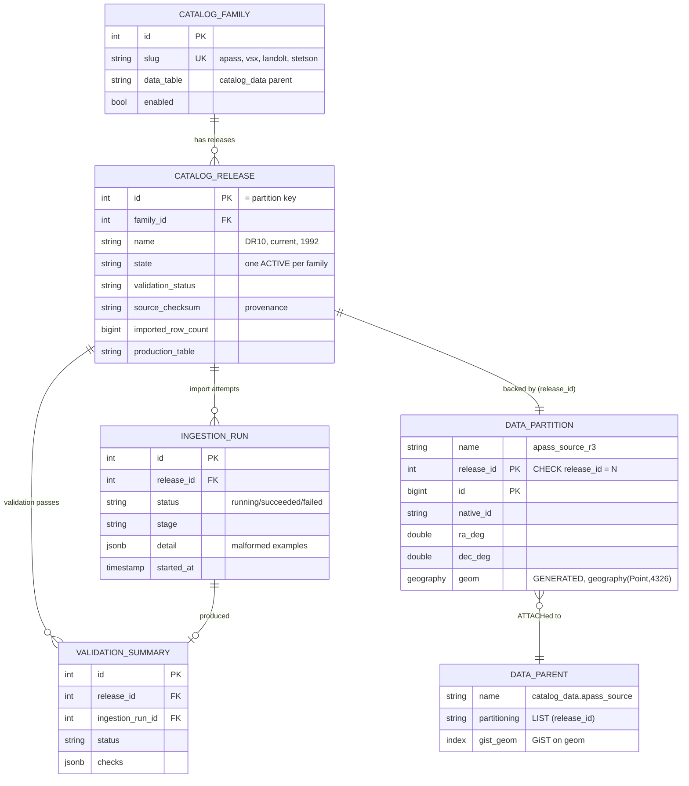
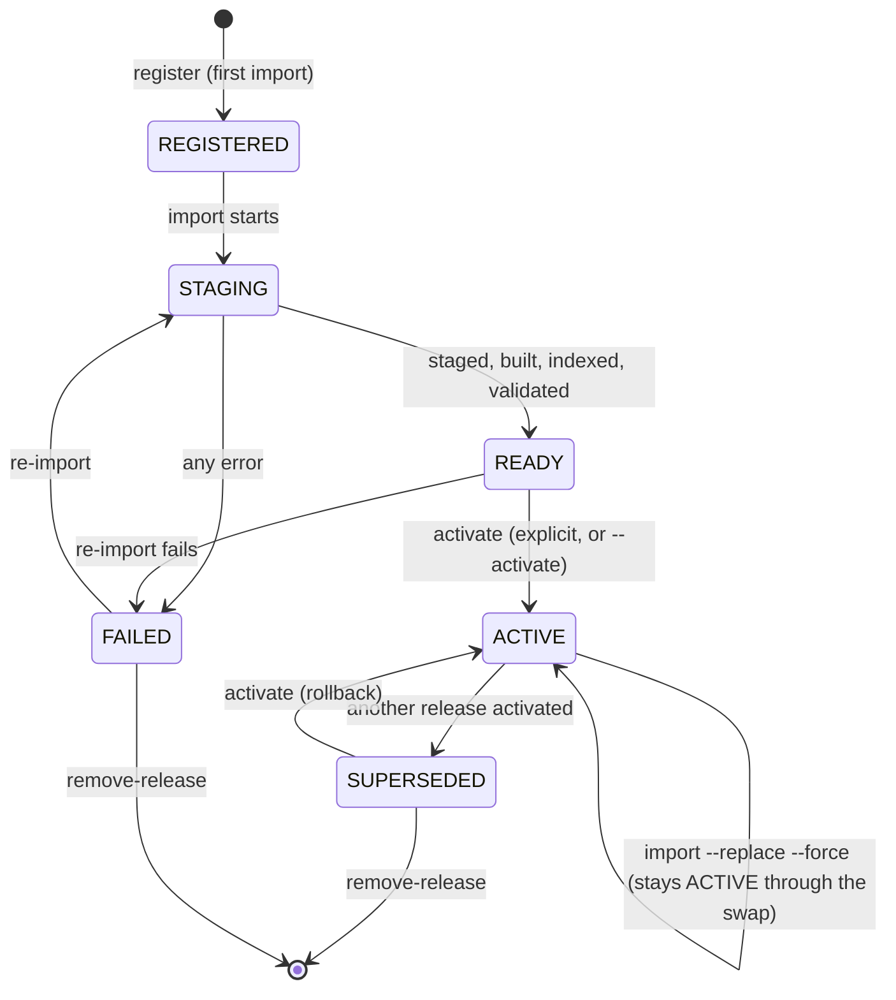

# Skycat database

A **standalone** PostgreSQL/PostGIS store for building and querying versioned
local astronomical reference catalogs. It owns its own database (`catalogs`),
Compose service (`skycat-postgres`, host port **5433**), volume
(`catalog_postgres_data`), SQLAlchemy metadata, Alembic environment, roles, and
configuration namespace (`SKYCAT_DB_*`).

The package and its full documentation live in this standalone repository. See
[`README.md`](../README.md) for the full package guide; this page is the
operator quick-reference.

## Architecture

```
skycat-postgres db: catalogs  127.0.0.1:5433  vol catalog_postgres_data (reference catalogs)
```

* Schemas: `catalog_registry` (families/releases/runs/validation/manifests),
  `catalog_data` (release-partitioned typed tables), `catalog_staging` (bulk load).
* Roles: `catalog_owner` (migrator), `catalog_ingest` (loader), `catalog_reader`
  (read-only), plus a bootstrap DBA for `init`.
* Spatial: `geography(Point,4326)` GENERATED column + GiST; spherical cone search
  (correct across RA 0/360 and the poles).
* Each catalog family is one `LIST (release_id)` partitioned table; activation
  flips a registry flag (atomic) and never rewrites rows.

### Schema map

`catalog_release.id` is the hinge: it is the registry's primary key, the
partition key of every family table, and the name of the physical partition
(`<parent>_r<release_id>`). Nothing else joins the three schemas together.



`catalog_staging` holds no permanent rows and joins to nothing: unlogged
`<family>_<release>_stg` tables during an import, plus retained
`<family>_<release>_rejects` tables afterwards for diagnosis.

### Release lifecycle

A release only becomes ACTIVE through an explicit, atomic activation from a
fully-built state. A failed or incomplete release can never auto-activate.



The self-loop is the one worth reading twice: replacing the ACTIVE release keeps
it ACTIVE for the whole rebuild, because the replacement is built detached and
swapped in atomically. The family is never left without an active release.

## Local Docker Compose

```bash
cp infra/docker/.env.example         infra/docker/.env
cp infra/docker/.env.secrets.example infra/docker/.env.secrets    # fill secrets

docker compose -f infra/docker/compose.yaml build skycat-postgres
docker compose -f infra/docker/compose.yaml up -d skycat-postgres

# init (PostGIS + roles + grants + migrate), then import + query
docker compose -f infra/docker/compose.yaml --profile skycat-tools run --rm skycat-init
docker compose -f infra/docker/compose.yaml --profile skycat-tools run --rm skycat-import apass dr6 --activate
docker compose -f infra/docker/compose.yaml --profile skycat-tools run --rm \
  skycat cone apass --ra 10 --dec 1 --radius-arcmin 5

# stop without deleting data
docker compose -f infra/docker/compose.yaml stop skycat-postgres
# deliberately delete the volume (explicit; `down` never removes it)
docker volume rm skycat_catalog_postgres_data
```

Source datasets are mounted **read-only** at `/catalog-data`
(`SKYCAT_DATA_ROOT`); the host default is `/srv/agents/catalogs`.

## Kubernetes

Connection settings come from environment, config maps, and secrets containing
`SKYCAT_DB_*` values. On-demand jobs (not part of a base kustomization, never
run on app startup):

```bash
kubectl apply -f infra/kubernetes/deploy/base/jobs/skycat-init.yaml     # DBA: postgis+roles+grants+migrate
kubectl apply -f infra/kubernetes/deploy/base/jobs/skycat-migrate.yaml  # owner: alembic upgrade
kubectl apply -f infra/kubernetes/deploy/base/jobs/skycat-ingest.yaml   # ingest: import one family/release
```

## Production provisioning

The catalog database can be provisioned externally for staging and production.
Provision the `catalogs` database, a bootstrap DBA role, and PostGIS first; the
package `init`/`migrate` jobs then create the operational roles and apply
migrations.

## Safety

`docker compose down` never deletes the catalog volume; active releases can't be
dropped without `--force`; the package refuses to migrate/ingest against
reserved PostgreSQL maintenance databases; production-like targets get extra
guards; source files are read-only and never modified or deleted.
