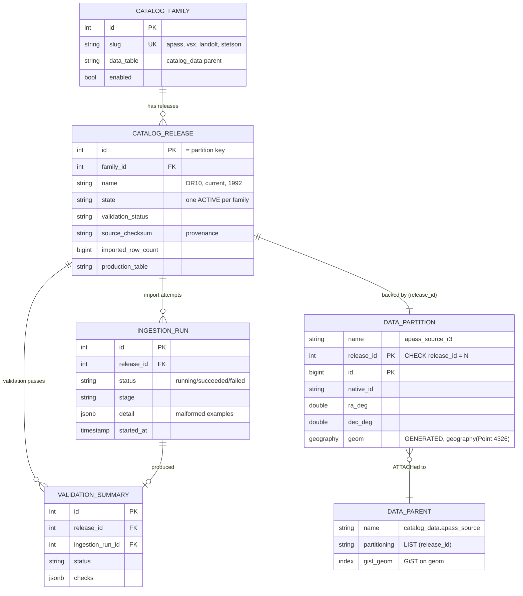
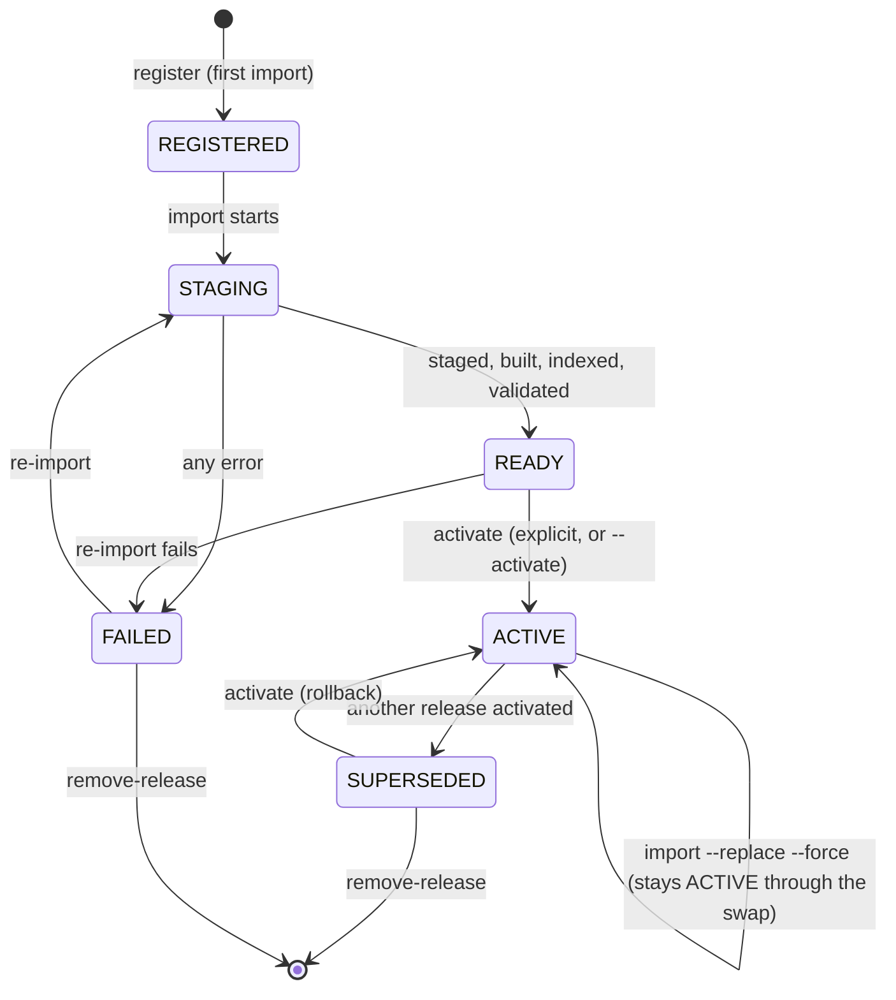

# Architecture

A **standalone** PostgreSQL/PostGIS store for building and querying versioned
local astronomical reference catalogs. Skycat owns its own database (`catalogs`),
Compose service (`skycat-postgres`, host port **5433**), volume
(`catalog_postgres_data`), SQLAlchemy metadata, Alembic environment, roles, and
configuration namespace (`SKYCAT_DB_*`). Nothing here is an add-on to a larger
service, and no table is registered on another application's metadata.

This page is the whole design in one pass: the database contract, how the three
schemas hinge together, the release model, the spatial model, the ingestion
lifecycle, and how it is deployed. [`README.md`](../../README.md) is the
task-oriented package guide; read that first if you are trying to *use* Skycat
rather than understand it.

```
Docker Compose project: skycat
└── skycat-postgres  db: catalogs  host 127.0.0.1:5433  vol catalog_postgres_data
```

## Database contract

The catalog store is a PostgreSQL database named `catalogs` by default. It
requires PostGIS and does not fall back to non-spatial Python filtering — see
[decision 0001](../decisions/0001-postgresql-postgis-only.md) for why that is
not negotiable.

| Schema | Purpose |
|---|---|
| `catalog_registry` | families, releases, ingestion runs, validation summaries, manifests |
| `catalog_data` | production catalog parent tables and release partitions |
| `catalog_staging` | unlogged staging and rejected-row tables during imports |

| Role | Used by | Capabilities |
|---|---|---|
| bootstrap / DBA, usually `catalog_admin` | `skycat init` only | enable PostGIS, create roles, apply grants |
| `catalog_owner` | Alembic migrations | owns schemas/objects, migrates catalog schema |
| `catalog_ingest` | import, activate, validation, maintenance jobs | loads staging, creates release partitions, writes registry metadata |
| `catalog_reader` | query clients | read-only registry/data access, plus TEMP tables for batch crossmatch |

### Schema map

`catalog_release.id` is the hinge: it is the registry's primary key, the
partition key of every family table, and the name of the physical partition
(`<parent>_r<release_id>`). Nothing else joins the three schemas together.



`catalog_staging` holds no permanent rows and joins to nothing: unlogged
`<family>_<release>_stg` tables during an import, plus retained
`<family>_<release>_rejects` tables afterwards for diagnosis.

## Catalog families

Each family gets its own scientifically typed table and parser instead of being
forced into a universal source table. Per-release oddities go in the `extra`
JSONB column, not new columns.

| Family | Releases | Parent table | Approx rows | Notes |
|---|---|---|---|---|
| `apass` | DR6, DR10 | `catalog_data.apass_source` | 42.6M / 128.6M | APASS superset schema; release-missing bands are `NULL` |
| `vsx` | current | `catalog_data.vsx_source` | 10.3M | AAVSO Variable Star Index fields |
| `landolt` | 1992, 2009 | `catalog_data.landolt_source` | 526 / 595 | stores V plus measured color indices |
| `stetson` | StetsonGlobs | `catalog_data.stetson_source` | 4.89M | UBVRI globular-cluster standards |

Static family/release definitions live in `skycat/registry/catalog_defs.py` —
the single source of truth for what catalogs exist. They define source
subdirectories, parser keys, data-file globs, auxiliary-file globs, and the
approximate row counts validation compares against. There is deliberately no
plugin or registration framework; adding a family is six explicit touch points,
worked through in [add-family.md](../guides/add-family.md).

Future families such as Tycho-2, Gaia, Pan-STARRS, 2MASS, UCAC5, SkyMapper, or
USNO-B1.0 follow the same family/release pattern.

## Release model

**Releases are a deployment mechanism, not a science dimension.** A family may
have many imported releases, but exactly one serves default queries. The active
release is `CatalogRelease.state == "active"`, enforced by a partial unique
index.

- Default queries use the active release.
- Explicit release selection is available for operations, rollback, parity
  checks, and reproducibility.
- A superseded release stays queryable and can be reactivated for rollback.
- Failed or incomplete releases can never activate.
- A gross row-count shortfall warns and blocks auto-activation unless the
  operator passes `--allow-warnings`.

Production tables are partitioned by `LIST (release_id)`. Each imported release
gets a physical child partition such as `catalog_data.apass_source_r2`.



The self-loop is the one worth reading twice: replacing the ACTIVE release keeps
it ACTIVE for the whole rebuild, because the replacement is built detached and
swapped in atomically. The family is never left without an active release.

## Spatial model

Every positional table stores `ra_deg` in `[0, 360)`, `dec_deg` in `[-90, 90]`,
and a generated PostGIS column `geom geography(Point,4326)`. The generated
expression maps RA to PostGIS longitude:

```sql
ST_SetSRID(
  ST_MakePoint(
    CASE WHEN ra_deg > 180 THEN ra_deg - 360 ELSE ra_deg END,
    dec_deg
  ),
  4326
)::geography
```

That expression is identical for every family and is never retyped — it comes
from `skycat/models/mixins.py`. `native_id`/`ra_deg`/`dec_deg` are declared per
family, because their types differ, and there are intentionally no helpers for
them.

Cone searches use `ST_DWithin(geom, search_point, radius_m, false)` for indexed
filtering, `ST_Distance(geom, search_point, false)` for separation, and a
consistent PostGIS sphere radius for degree/metre conversion. `use_spheroid =>
false` makes the maths spherical, so RA 0/360 wraparound and the poles are
correct — in the database. There is no RA/Dec box scan and no Python-side
spherical filtering anywhere on the main query path.

## Query API

The low-level query functions live under `skycat/query/`:

- `cone_search()` returns rows inside a cone, defaulting to nearest-first.
- `lookup_native_id()` returns rows by catalog-native source identifier.
- `batch_crossmatch()` matches many input coordinates in one round trip.
- `cone_search_plan()` returns `EXPLAIN` output for index-plan verification.

`CatalogReader` in `skycat/client.py` is the supported Python entry point: one
lazy pooled engine bound to `catalog_reader`, a 60s active-release cache, and a
default 30s statement timeout. The bare query functions accept `engine=` and
`resolved=` so the reader can supply both. What of this is contractual is listed
in [api-stability.md](api-stability.md).

## Ingestion lifecycle

`skycat/ingestion/runner.py` is the most subtle file in the repository. One
import runs:

1. Discover source files under `SKYCAT_DATA_ROOT` or an explicit source
   directory.
2. Compute a manifest checksum, or a full content checksum if requested.
3. Register/sync the family and release metadata.
4. Create an `IngestionRun` record.
5. Stream parser rows into an unlogged staging table with PostgreSQL `COPY`.
6. Mark invalid staging rows with `reject_reason`.
7. Retain rejected rows in a separate staging table for diagnostics.
8. Build a *detached* incoming production table.
9. Insert valid staging rows into the detached table.
10. Add the release-id CHECK, primary key, replicated parent indexes, and
    `ANALYZE`.
11. Validate production row counts, status, and spatial index presence.
12. Attach the partition.
13. Mark the release `READY`.
14. Optionally activate it explicitly or via `--activate`.
15. Record completion or failure.

Steps 8–11 are the load-bearing part: the multi-minute rebuild takes **no lock
on the partition parent**, so the old release keeps serving reads until step 12,
a short transaction that drops the old partition, renames, and `ATTACH
PARTITION`s the new one. Registry and run rows are written on a separate
connection, so a failure is always recorded.

Catalog data never goes into a migration; it arrives only through ingestion.
Where the source files come from and how a release is tied back to an upstream
snapshot is [provenance.md](../guides/provenance.md).

## Migrations

Migrations are a linear numeric chain (`0001`…`0006`) with the Alembic version
table in `catalog_registry`. `skycat/migrations/env.py` resolves the database URL
from `SKYCAT_DB_*` (admin role) or `-x url=`, never from `alembic.ini`.

## Deployment

### Local Docker Compose

```bash
cp infra/docker/.env.example         infra/docker/.env
cp infra/docker/.env.secrets.example infra/docker/.env.secrets    # fill secrets

docker compose -f infra/docker/compose.yaml build skycat-postgres
docker compose -f infra/docker/compose.yaml up -d skycat-postgres

# init (PostGIS + roles + grants + migrate), then import + query
docker compose -f infra/docker/compose.yaml --profile skycat-tools run --rm skycat-init
docker compose -f infra/docker/compose.yaml --profile skycat-tools run --rm skycat-import apass dr6 --activate
docker compose -f infra/docker/compose.yaml --profile skycat-tools run --rm \
  skycat cone apass --ra 10 --dec 1 --radius-arcmin 5

# stop without deleting data
docker compose -f infra/docker/compose.yaml stop skycat-postgres
# deliberately delete the volume (explicit; `down` never removes it)
docker volume rm skycat_catalog_postgres_data
```

Compose also defines `skycat-migrate`, `skycat-health`, `skycat-validate`, and
`skycat-reset` under the same `skycat-tools` profile. Source datasets are mounted
**read-only** at `/catalog-data` (`SKYCAT_DATA_ROOT`); the host default is
`/srv/agents/catalogs`.

### Kubernetes

Connection settings come from environment, config maps, and secrets containing
`SKYCAT_DB_*` values. These are on-demand one-shot jobs — not part of a base
kustomization, and never run on ordinary application startup:

```bash
kubectl apply -f infra/kubernetes/deploy/base/jobs/skycat-init.yaml     # DBA: postgis+roles+grants+migrate
kubectl apply -f infra/kubernetes/deploy/base/jobs/skycat-migrate.yaml  # owner: alembic upgrade
kubectl apply -f infra/kubernetes/deploy/base/jobs/skycat-ingest.yaml   # ingest: import one family/release
```

The ingest Job reads the CLI's exit codes, which is why they are a contract: an
`--activate` that did not activate must exit non-zero.

### Production provisioning

The catalog database can be provisioned externally for staging and production.
Provision the `catalogs` database, a bootstrap DBA role, and PostGIS first; the
package `init`/`migrate` jobs then create the operational roles and apply
migrations.

## Safety properties

`docker compose down` never deletes the catalog volume. Active releases cannot
be dropped without `--force`. The package refuses to migrate or ingest against
reserved PostgreSQL maintenance databases, production-like targets get extra
guards, and `import` prints its target before loading. Source files are
read-only and are never modified or deleted.

What each destructive command actually destroys is tabulated in
[runbook.md](../operations/runbook.md).
